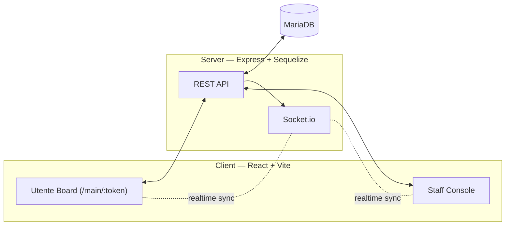

# InovLAR

> Tablet-based communication and request system for nursing home patients.

[🇵🇹 Ler em português](README.pt.md)


---

## Overview

InovLAR gives patients with limited mobility or speech a simple, staff-configurable tablet board for sending requests — "I need help", "water", "bathroom", an emergency SOS — to staff in real time. Staff get a management console to configure patients, request buttons, and table layouts, and to monitor incoming requests on phone-, tablet-, or TV-sized screens.

It was built for a nursing home (*lar de idosos*) context, but the core pattern — a configurable grid of request buttons feeding a real-time queue to a monitoring console — generalizes to other request/triage workflows: hospital triage boards, retail/customer-service call buttons, kitchen order queues, and similar systems. Making it easy to fork and adapt to a different vocabulary of "buttons" is one of the goals of open-sourcing this project.

## Features

- **Customizable request buttons** — staff define the icon, label, and category for each button; patients tap to send a request.
- **Variable-size buttons & category coloring** — buttons can span multiple grid cells, and categories get consistent color-coding across the board (staff-overridable).
- **Per-patient table layouts + templates** — staff can lay out a custom board per patient/device, or apply a shared template to many patients at once.
- **Real-time sync** — every change (new request, resolved request, edited button) is broadcast over Socket.io so all connected clients stay in sync.
- **Emergency SOS** — always prioritized, visually distinct, in every monitoring view.
- **Three monitoring layouts** — optimized for phone, tablet, and large TV/wall-mounted screens.
- **Kiosk mode** — the patient board is a locked-down "cage": a staff PIN is required to open the management console; patients only see their board.

## Two interfaces

- **Utente (Patient) board** — a tablet-friendly grid of request buttons, a history drawer of past requests, and an emergency SOS button. Accessed through an obfuscated URL token (`/main/:token`), not a login.
- **Staff console** — patient profiles, button/category management, request monitoring dashboards, and the table/template layout editor. Protected by a shared PIN (see [Getting Started](#getting-started)).

## Architecture



**Stack:** React (Vite, Ant Design, Bootstrap) on the client × Express + Sequelize ORM (MariaDB) + Socket.io on the server, with bcryptjs for staff authentication.

Any mutating API call triggers a Socket.io broadcast; connected clients re-fetch the affected data. There are no per-record subscriptions — it's a simple "something changed, refresh" signal, which keeps the client state model easy to reason about.

## Getting Started

### Prerequisites

- **Node.js ≥ 20** (required by the `mariadb` connector — check with `node -v`)
- **MariaDB** installed and running locally ([mariadb.org/download](https://mariadb.org/download/))
- `npm`

### Quick start (Windows)

From the repo root:

```powershell
./install.ps1
```

This creates the dev database + app user in MariaDB, writes `Server/.env`, runs `npm install` in both `Server/` and `Client/`, and runs migrations + seeders. It's idempotent — safe to re-run. See `Get-Help ./install.ps1 -Full` for parameters (DB name/user, root password, etc.).

> If MariaDB isn't on your `PATH`, the script looks for it under `C:\Program Files\MariaDB*\bin\mysql.exe` automatically.

### Manual setup (any OS)

1. **Create the database + app user in MariaDB:**
   ```sql
   CREATE DATABASE inovlar_dev CHARACTER SET utf8mb4 COLLATE utf8mb4_unicode_ci;
   CREATE USER 'inovlar_app'@'localhost' IDENTIFIED BY 'yourpassword';
   GRANT ALL ON inovlar_dev.* TO 'inovlar_app'@'localhost';
   FLUSH PRIVILEGES;
   ```
2. **Configure `Server/.env`** — copy `Server/.env.example` and fill in `DB_NAME`, `DB_USER`, `DB_PASS`, `DB_HOST`, `DB_PORT`. Never committed — it's in `.gitignore`.
3. **Install, migrate, seed:**
   ```bash
   cd Server
   npm i
   npx sequelize-cli db:migrate
   npx sequelize-cli db:seed:all   # seeds the 43 default request buttons
   node main.js                     # runs on http://localhost:3000
   ```
4. **Client** (separate shell):
   ```bash
   cd Client
   npm i
   npm run dev                  # Vite dev server with HMR, http://localhost:5173
   ```

### Production build

```bash
cd Client && npm run build   # generates Client/dist/
cd ../Server && node main.js # serves the React build + API + Socket.io on http://<ip>:3000
```

### Raspberry Pi deployment

`install.sh` at the repo root automates a full production install on a Raspberry Pi (Raspberry Pi OS/Debian): installs MariaDB, creates the DB/user, installs dependencies, builds the client, runs migrations/seeders, and registers a `systemd` service so the app survives reboots:

```bash
sudo bash install.sh
```

See the script's header comments and `DEVELOPMENT_LOG.md` (Phase 3 entries) for platform-specific gotchas (Node version resolution under `sudo`, MariaDB table-name case sensitivity differences between Windows and Linux, armhf package availability).

## Usage

1. **First run** — open the app; since no staff password exists yet, you'll be prompted to define one. This is a single shared PIN for the whole device (not per-user accounts), matching the kiosk-style deployment.
2. **Staff console** — enter the PIN to manage patients, request buttons, categories, and table layouts, and to monitor incoming requests.
3. **Patient board** — each patient gets an obfuscated URL (`/main/:token`) pointing straight at their configured board. Opening it locks the device into kiosk mode; only the staff PIN (via a hidden exit prompt) reopens the management console.
4. **Requests** — a patient tap creates a request instantly visible (via Socket.io) on every open staff monitoring view, color-coded by wait time, with emergencies always prioritized.

## Documentation

- [DEVELOPMENT_LOG.md](DEVELOPMENT_LOG.md) — chronological decision log covering authentication design, responsive layout work, image handling, the SQLite → MariaDB migration, and Raspberry Pi deployment history.

## Contributing

Issues and pull requests are welcome — this project is being prepared for open-source release specifically so it can be forked and adapted to other request/triage contexts. Please open an issue to discuss significant changes before submitting a large PR.

## License

*To be announced.* This repository is being prepared for open-source publication alongside an academic paper describing the system; a license will be added here once finalized.

## Academic Context & Acknowledgments

InovLAR was developed as part of a real-world nursing home deployment (including production use on a Raspberry Pi), with AI-assisted development throughout the process. It is being prepared for open-source release and an accompanying academic publication so that others can reuse or adapt the system for similar communication/request/triage needs. `DEVELOPMENT_LOG.md` records the full chronological history of design decisions and changes.

## Citation

A citation entry (and paper reference, once published) will be added here. If you use this project in academic work in the meantime, please reference the GitHub repository directly.
