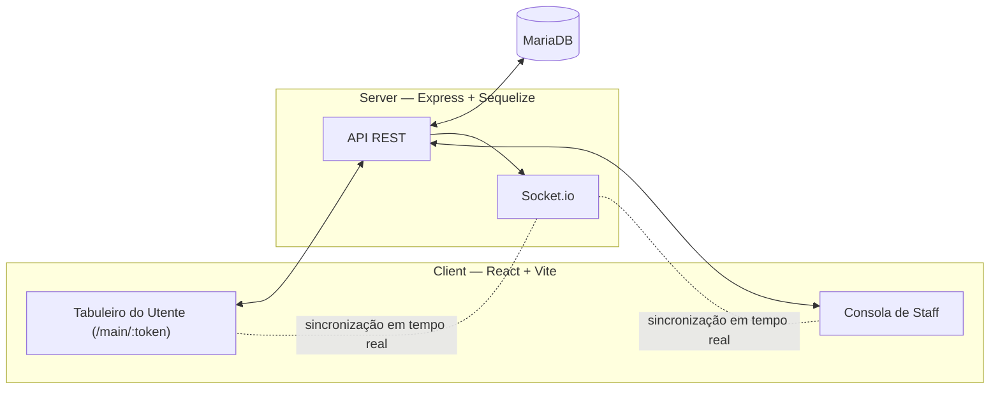

# InovLAR

> Sistema de comunicação e pedidos por tablet para utentes de lares de idosos.

[🇬🇧 Read in English](README.md)


---

## Visão geral

O InovLAR dá a utentes com mobilidade ou fala limitadas um tabuleiro tátil simples, configurável pela equipa, para enviar pedidos — "preciso de ajuda", "água", "casa de banho", uma emergência SOS — à equipa em tempo real. A equipa tem uma consola de gestão para configurar utentes, botões de pedido e disposições de tabuleiro, e para monitorizar pedidos recebidos em ecrãs de telemóvel, tablet ou TV.

Foi construído para o contexto de um lar de idosos, mas o padrão de base — uma grelha configurável de botões de pedido que alimenta uma fila em tempo real para uma consola de monitorização — generaliza-se a outros fluxos de pedidos/triagem: painéis de triagem hospitalar, botões de chamada em retalho/atendimento ao cliente, filas de pedidos em cozinha, e sistemas semelhantes. Facilitar o fork e a adaptação a um vocabulário diferente de "botões" é um dos objetivos de tornar este projeto open source.

## Funcionalidades

- **Botões de pedido personalizáveis** — a equipa define o ícone, o texto e a categoria de cada botão; os utentes tocam para enviar um pedido.
- **Botões de tamanho variável e cor por categoria** — os botões podem ocupar várias células da grelha, e as categorias têm cor consistente em todo o tabuleiro (a equipa pode substituir a cor por omissão).
- **Disposições de tabuleiro por utente + templates** — a equipa pode desenhar um tabuleiro à medida por utente/dispositivo, ou aplicar um template partilhado a vários utentes de uma vez.
- **Sincronização em tempo real** — cada alteração (novo pedido, pedido resolvido, botão editado) é transmitida via Socket.io para que todos os clientes ligados fiquem sincronizados.
- **Emergência SOS** — sempre prioritária, visualmente distinta, em todas as vistas de monitorização.
- **Três layouts de monitorização** — otimizados para telemóvel, tablet, e ecrãs grandes de TV/parede.
- **Modo kiosk** — o tabuleiro do utente é uma "gaiola" fechada: é preciso um PIN da equipa para abrir a consola de gestão; os utentes só veem o seu tabuleiro.

## Duas interfaces

- **Tabuleiro do Utente (Paciente)** — uma grelha de botões de pedido adaptada a tablet, uma gaveta de histórico de pedidos anteriores, e um botão de emergência SOS. Acedida através de um token de URL ofuscado (`/main/:token`), não de um login.
- **Consola de Staff** — perfis de utentes, gestão de botões/categorias, painéis de monitorização de pedidos, e o editor de disposições de tabuleiro/template. Protegida por um PIN partilhado (ver [Como Começar](#como-começar)).

## Arquitetura



**Stack:** React (Vite, Ant Design, Bootstrap) no cliente × Express + Sequelize ORM (MariaDB) + Socket.io no servidor, com bcryptjs para a autenticação da equipa.

Qualquer chamada à API que altere dados dispara uma transmissão via Socket.io; os clientes ligados voltam a pedir os dados afetados. Não há subscrições por registo — é um sinal simples de "algo mudou, atualiza", o que mantém o modelo de estado do cliente fácil de perceber.

## Como Começar

### Pré-requisitos

- **Node.js ≥ 20** (exigido pelo conector `mariadb` — confirma com `node -v`)
- **MariaDB** instalado e a correr localmente ([mariadb.org/download](https://mariadb.org/download/))
- `npm`

### Início rápido (Windows)

A partir da raiz do repositório:

```powershell
./install.ps1
```

Isto cria a base de dados e o utilizador de desenvolvimento no MariaDB, escreve `Server/.env`, corre `npm install` no `Server/` e no `Client/`, e corre migrations + seeders. É idempotente — seguro de correr outra vez. Ver `Get-Help ./install.ps1 -Full` para os parâmetros (nome da BD/utilizador, password de root, etc.).

> Se o MariaDB não estiver no `PATH`, o script procura-o automaticamente em `C:\Program Files\MariaDB*\bin\mysql.exe`.

### Instalação manual (qualquer SO)

1. **Criar a base de dados + utilizador da app no MariaDB:**
   ```sql
   CREATE DATABASE inovlar_dev CHARACTER SET utf8mb4 COLLATE utf8mb4_unicode_ci;
   CREATE USER 'inovlar_app'@'localhost' IDENTIFIED BY 'a_tua_password';
   GRANT ALL ON inovlar_dev.* TO 'inovlar_app'@'localhost';
   FLUSH PRIVILEGES;
   ```
2. **Configurar `Server/.env`** — copia `Server/.env.example` e preenche `DB_NAME`, `DB_USER`, `DB_PASS`, `DB_HOST`, `DB_PORT`. Nunca é commitado — está no `.gitignore`.
3. **Instalar, migrar, semear:**
   ```bash
   cd Server
   npm i
   npx sequelize-cli db:migrate
   npx sequelize-cli db:seed:all   # semeia os 43 botões de pedido predefinidos
   node main.js                     # corre em http://localhost:3000
   ```
4. **Client** (noutra consola):
   ```bash
   cd Client
   npm i
   npm run dev                  # servidor Vite com HMR, http://localhost:5173
   ```

### Build de produção

```bash
cd Client && npm run build   # gera Client/dist/
cd ../Server && node main.js # serve o build do React + API + Socket.io em http://<ip>:3000
```

### Deployment numa Raspberry Pi

O `install.sh` na raiz do repositório automatiza uma instalação de produção completa numa Raspberry Pi (Raspberry Pi OS/Debian): instala o MariaDB, cria a BD/utilizador, instala as dependências, faz o build do client, corre migrations/seeders, e regista um serviço `systemd` para a app sobreviver a reboots:

```bash
sudo bash install.sh
```

Ver os comentários no topo do script e o `DEVELOPMENT_LOG.md` (entradas da Fase 3) para as particularidades específicas da plataforma (resolução da versão do Node sob `sudo`, diferenças de sensibilidade a maiúsculas/minúsculas nos nomes de tabelas do MariaDB entre Windows e Linux, disponibilidade de pacotes para armhf).

## Utilização

1. **Primeira vez** — abre a app; como ainda não existe password de staff, vais ser convidado a definir uma. É um único PIN partilhado para todo o dispositivo (não contas por pessoa), alinhado com o deployment em modo kiosk.
2. **Consola de staff** — insere o PIN para gerir utentes, botões de pedido, categorias e disposições de tabuleiro, e para monitorizar pedidos recebidos.
3. **Tabuleiro do utente** — cada utente tem um URL ofuscado (`/main/:token`) que aponta diretamente para o seu tabuleiro configurado. Abri-lo bloqueia o dispositivo em modo kiosk; só o PIN da equipa (via um prompt de saída escondido) reabre a consola de gestão.
4. **Pedidos** — um toque do utente cria um pedido instantaneamente visível (via Socket.io) em qualquer vista de monitorização de staff aberta, com cor conforme o tempo de espera, e emergências sempre prioritárias.

## Documentação

- [DEVELOPMENT_LOG.md](DEVELOPMENT_LOG.md) — registo cronológico de decisões, cobrindo o desenho da autenticação, o trabalho de layout responsivo, a gestão de imagens, a migração de SQLite para MariaDB, e o histórico de deployment na Raspberry Pi.

## Contribuir

Issues e pull requests são bem-vindos — este projeto está a ser preparado para lançamento open source precisamente para poder ser "forkado" e adaptado a outros contextos de pedidos/triagem. Por favor abre uma issue para discutir mudanças significativas antes de submeteres um PR grande.

## Licença

*A anunciar.* Este repositório está a ser preparado para publicação open source em conjunto com um artigo científico que descreve o sistema; uma licença será adicionada aqui assim que for decidida.

## Contexto Académico e Agradecimentos

O InovLAR foi desenvolvido no contexto de um deployment real num lar de idosos (incluindo uso em produção numa Raspberry Pi), com apoio de IA ao longo do processo de desenvolvimento. Está a ser preparado para lançamento open source e uma publicação académica que o acompanha, para que outros possam reutilizar ou adaptar o sistema a necessidades semelhantes de comunicação/pedidos/triagem. O `DEVELOPMENT_LOG.md` regista o histórico cronológico completo de decisões de design e alterações.

## Como Citar

Uma entrada de citação (e referência ao artigo, assim que publicado) será adicionada aqui. Se usares este projeto em trabalho académico entretanto, por favor referencia diretamente o repositório do GitHub.
